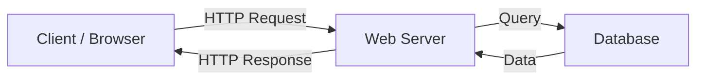
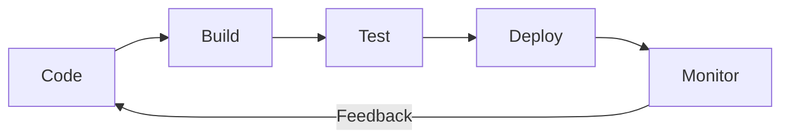
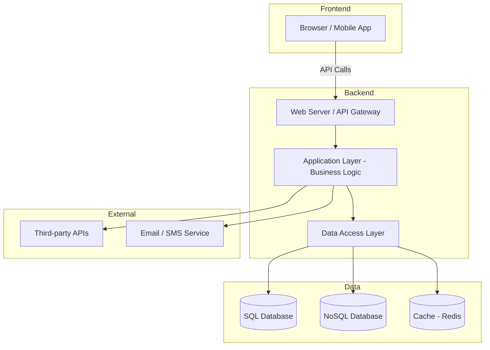

# What Is Backend? สรุปครบจบเรื่อง Server-Side Development

---

## 1. Backend คืออะไร?

**Backend** (หรือ Server-Side) คือส่วนของแอปพลิเคชันที่ทำงาน **"เบื้องหลัง"** ซึ่งผู้ใช้มองไม่เห็นโดยตรง ทำหน้าที่:

- **ประมวลผล Business Logic** — กฎเกณฑ์ทางธุรกิจ เช่น คำนวณราคา, ตรวจสอบสิทธิ์
- **จัดการฐานข้อมูล** — อ่าน/เขียน/อัปเดต/ลบข้อมูล (CRUD)
- **ให้บริการ API** — เปิดช่องทางให้ Frontend หรือระบบอื่นเรียกใช้ข้อมูล
- **รักษาความปลอดภัย** — Authentication, Authorization, Encryption

> [!NOTE]
> ถ้า Frontend คือ **"หน้าร้าน"** ที่ลูกค้ามองเห็น → Backend คือ **"ครัวหลังร้าน"** ที่ทำอาหารทั้งหมด

---

## 2. สถาปัตยกรรม Backend (Architecture)

### Client-Server Model



### รูปแบบสถาปัตยกรรมหลัก

| รูปแบบ | คำอธิบาย | เหมาะกับ |
|--------|----------|----------|
| **Monolithic** | ทุกอย่างอยู่ใน Codebase เดียว | โปรเจกต์เล็ก-กลาง, ทีมเล็ก |
| **Microservices** | แยกเป็น Service ย่อยๆ แต่ละตัวทำงานอิสระ | ระบบใหญ่, ต้องการ Scale แยกส่วน |
| **Serverless** | รันโค้ดเป็น Function ไม่ต้องจัดการ Server เอง | Event-driven, ใช้งานไม่สม่ำเสมอ |
| **MVC** | แยก Model-View-Controller เป็นชั้นๆ | Web App ทั่วไป |
| **Clean / Layered** | แยกเป็น Layer (Domain, Application, Infrastructure) | Enterprise App |

---

## 3. ภาษาและ Framework ยอดนิยม

| ภาษา | Framework ยอดนิยม | จุดเด่น |
|-------|-------------------|---------|
| **JavaScript/TypeScript** | Node.js, Express, NestJS | Full-stack ได้, Async I/O ดี |
| **Python** | Django, Flask, FastAPI | เรียนง่าย, ML/Data Science |
| **C#** | ASP.NET Core | Enterprise, Performance ดี |
| **Java** | Spring Boot | Enterprise, Ecosystem ใหญ่ |
| **Go** | Gin, Echo | เร็ว, Concurrency ดี |
| **PHP** | Laravel | Web Dev ดั้งเดิม, ง่าย |
| **Ruby** | Rails | Productive, Convention over Config |
| **Rust** | Actix, Axum | Performance สูงสุด, Memory Safe |

---

## 4. ฐานข้อมูล (Database)

### Relational (SQL)
- **PostgreSQL** — Open-source ที่แข็งแกร่งที่สุด, รองรับ JSON, Full-text Search
- **MySQL / MariaDB** — ง่าย, แพร่หลาย
- **SQL Server** — Enterprise ของ Microsoft

### Non-Relational (NoSQL)
- **MongoDB** — Document-based, Schema ยืดหยุ่น
- **Redis** — In-memory, ใช้เป็น Cache / Session Store
- **Elasticsearch** — Full-text Search Engine

### เลือกอย่างไร?

```
ข้อมูลมีโครงสร้างชัดเจน + ต้องการ ACID → SQL
ข้อมูลยืดหยุ่น + Scale แนวนอน          → NoSQL
ต้องการ Caching / Real-time             → Redis
ต้องการ Search                          → Elasticsearch
```

---

## 5. API — ช่องทางสื่อสารระหว่าง Frontend กับ Backend

### รูปแบบ API หลัก

| แบบ | คำอธิบาย | เหมาะกับ |
|-----|----------|----------|
| **REST** | ใช้ HTTP Methods (GET, POST, PUT, DELETE) | Web API ทั่วไป |
| **GraphQL** | Client กำหนดข้อมูลที่ต้องการเอง | Data-heavy App, ลด Over-fetching |
| **gRPC** | Binary protocol, เร็วมาก | Microservices คุยกันเอง |
| **WebSocket** | Real-time, 2-way communication | Chat, Live data |

### ตัวอย่าง REST API

```
GET    /api/users          → ดึงรายชื่อ users ทั้งหมด
GET    /api/users/123      → ดึง user ID 123
POST   /api/users          → สร้าง user ใหม่
PUT    /api/users/123      → อัปเดต user ID 123
DELETE /api/users/123      → ลบ user ID 123
```

---

## 6. Authentication & Authorization

| แนวคิด | คำอธิบาย |
|---------|----------|
| **Authentication (AuthN)** | ยืนยันตัวตน — "คุณคือใคร?" |
| **Authorization (AuthZ)** | ตรวจสอบสิทธิ์ — "คุณทำอะไรได้บ้าง?" |

### วิธีที่นิยม

- **JWT (JSON Web Token)** — Stateless, เหมาะกับ REST API / SPA
- **Session-based** — เก็บ Session ฝั่ง Server, เหมาะกับ Web App แบบดั้งเดิม
- **OAuth 2.0** — สำหรับ Login ผ่าน Third-party (Google, Facebook)
- **API Key** — สำหรับ Service-to-Service

---

## 7. DevOps & Deployment

### กระบวนการหลัก



### เครื่องมือสำคัญ

| หมวด | เครื่องมือ |
|------|-----------|
| **Version Control** | Git, GitHub, GitLab |
| **CI/CD** | GitHub Actions, Jenkins, Azure DevOps |
| **Container** | Docker, Kubernetes |
| **Cloud** | AWS, Azure, GCP |
| **Monitoring** | Prometheus, Grafana, ELK Stack |

---

## 8. แนวคิดสำคัญที่ Backend Developer ต้องรู้

### Security
- **Input Validation** — ป้องกัน SQL Injection, XSS
- **HTTPS** — เข้ารหัสการสื่อสาร
- **CORS** — ควบคุม Cross-Origin Request
- **Rate Limiting** — ป้องกัน DDoS / Brute Force

### Performance & Scalability
- **Caching** — ใช้ Redis / CDN ลดโหลด Database
- **Load Balancing** — กระจาย Traffic ไปหลาย Server
- **Horizontal Scaling** — เพิ่มจำนวน Server
- **Vertical Scaling** — เพิ่ม Resource (CPU, RAM) ให้ Server เดิม
- **Database Indexing** — เร่งความเร็วการ Query

### Design Patterns
- **Repository Pattern** — แยก Data Access ออกจาก Business Logic
- **Dependency Injection** — ลด Coupling, ง่ายต่อ Testing
- **CQRS** — แยก Read/Write Operations
- **Event Sourcing** — บันทึกทุก Event แทนที่จะบันทึกแค่สถานะล่าสุด

---

## 9. Roadmap สำหรับผู้เริ่มต้น

```
1. เลือกภาษา 1 ตัว (แนะนำ: JavaScript/TypeScript หรือ Python)
       ↓
2. เรียนรู้ HTTP, REST API พื้นฐาน
       ↓
3. เรียนรู้ Framework (Express/NestJS หรือ FastAPI/Django)
       ↓
4. เรียนรู้ Database (เริ่มจาก SQL → PostgreSQL)
       ↓
5. Authentication (JWT, Session)
       ↓
6. Version Control (Git)
       ↓
7. Docker + Basic Deployment
       ↓
8. Testing (Unit Test, Integration Test)
       ↓
9. CI/CD Pipeline
       ↓
10. Design Patterns + Clean Architecture
```

---

## 10. สรุป — Backend ในมุมมองภาพรวม



> [!TIP]
> Backend Development ไม่ใช่แค่เขียนโค้ด แต่คือการ **ออกแบบระบบ** ที่ปลอดภัย, รวดเร็ว, และรองรับการเติบโตได้ — ยิ่งเข้าใจ Architecture และ Design Patterns มากเท่าไหร่ ยิ่งเป็น Developer ที่ดีขึ้น
