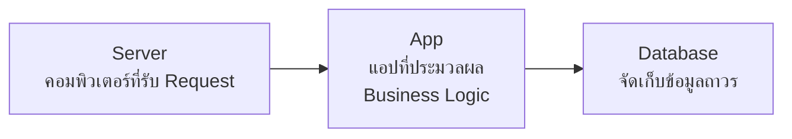
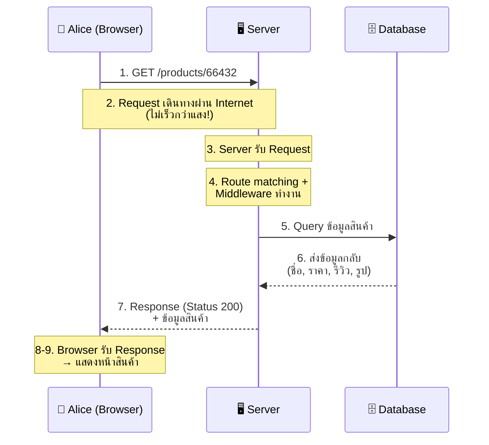

# สรุปบทความ: What is Back-End Architecture?

> แหล่งที่มา: [Codecademy — What is Back-End Architecture?](https://www.codecademy.com/article/what-is-back-end-architecture)

---

## 1. Client คืออะไร?

**Client** คือสิ่งที่ส่ง Request ไปยัง Backend ได้แก่:

- 🌐 **Browser** — ร้องขอ HTML/JS เพื่อแสดงเว็บไซต์
- 📱 **Mobile App**
- 🖥️ **แอปบน Server อื่น**
- 📟 **อุปกรณ์ IoT / Smart Device**

---

## 2. Back-End คืออะไร?

Back-End คือ **เทคโนโลยีทั้งหมดที่ทำหน้าที่ประมวลผล Request และสร้าง Response** ประกอบด้วย 3 ส่วนหลัก:



| ส่วนประกอบ | หน้าที่ |
|-----------|---------|
| **Server** | คอมพิวเตอร์ที่คอยรับ Request — เครื่องไหนก็ได้ที่ต่อ Network |
| **App** | แอปที่รันบน Server ฟัง Request → ดึงข้อมูลจาก DB → ส่ง Response |
| **Database** | จัดเก็บข้อมูลแบบถาวร (Persistent) ในหน่วยความจำ |

---

## 3. Core Functions ของ App

### Routing
- ทุก Request มี **HTTP Verb** (GET, POST, PUT, DELETE) + **URI** (เช่น `/products/66432`)
- คู่ของ HTTP Verb + URI เรียกว่า **Route**
- การจับคู่ Request กับ Route เรียกว่า **Routing**

### Middleware
**Middleware** คือโค้ดที่ทำงาน **ระหว่าง** รับ Request กับส่ง Response:

```
Request → [Middleware 1] → [Middleware 2] → ... → [Middleware สุดท้าย → ส่ง Response]
```

- แก้ไข Request Object
- Query ฐานข้อมูล
- ประมวลผล Request
- ส่งต่อไป Middleware ถัดไป จนถึงตัวสุดท้ายที่ส่ง Response กลับ

> [!NOTE]
> Framework อย่าง **Express** หรือ **Ruby on Rails** ช่วยให้การเขียน Routing ง่ายขึ้น

---

## 4. ประเภท Response ที่ Server ส่งกลับ

| ประเภท | ตัวอย่าง |
|--------|----------|
| **HTML File** | หน้าเว็บสำเร็จรูป |
| **JSON Data** | ข้อมูลสำหรับ SPA / Mobile App |
| **HTTP Status Code** | `200` สำเร็จ, `404` ไม่พบ, `500` Server Error |

---

## 5. Database — ทำไมต้องใช้?

- **จัดเก็บข้อมูลถาวร** — ข้อมูลไม่หายแม้ Server ดับ/รีสตาร์ท
- **ลดภาระ RAM** ของ Server CPU
- รองรับทั้ง **อ่านข้อมูล** (Client ขอดูข้อมูล) และ **เขียนข้อมูล** (Client ส่งข้อมูลเข้ามา)

> [!IMPORTANT]
> Database query เป็นหนึ่งในขั้นตอนที่ **ช้าที่สุด** เพราะการอ่าน/เขียน Static Memory ใช้เวลา และ Database อาจอยู่คนละเครื่องกับ Server

---

## 6. Web API คืออะไร?

- **API** = วิธีการสื่อสารที่ชัดเจนระหว่าง Software Components
- **Web API** = Interface ที่ Backend สร้างขึ้น → กลุ่มของ **Endpoints** + **Resources**

```
Web API กำหนดโดย:
  ✅ ประเภท Request ที่รับได้ (Routes ที่นิยาม)
  ✅ ประเภท Response ที่ Client คาดหวัง
```

> [!TIP]
> **Web API เดียว** สามารถให้บริการข้อมูลแก่ Frontend หลายตัวได้ (เว็บ, มือถือ, Desktop) เพราะ API ไม่ได้กำหนดว่าจะ **แสดงผล** ข้อมูลอย่างไร

---

## 7. หลักการ Request-Response Cycle

กฎสำคัญ 3 ข้อ:

1. ❌ Server **ไม่สามารถ** ส่ง Response โดยไม่มี Request
2. ✅ ทุก Request **ต้องมี** Response (แม้แค่ 404) — ไม่งั้น Client จะรอไม่รู้จบ
3. ❌ Server **ห้าม** ส่ง Response **มากกว่า 1 ครั้ง** ต่อ 1 Request — จะเกิด Error

---

## 8. ตัวอย่างจริง: Mapping Out a Request

สมมติ Alice ซื้อของบน SuperCoolShop.com:



> [!NOTE]
> เว็บไซต์ใหญ่ที่มีผู้ใช้ทั่วโลกจะมี **Server หลายตัว** และพาผู้ใช้ไปที่ Server ที่ใกล้ที่สุด เพื่อลด Latency

---

## 9. FAQ สรุปสั้น

| คำถาม | คำตอบ |
|-------|-------|
| **ส่วนประกอบหลักของ Backend?** | Server + Application + Database |
| **ต่างจาก Frontend อย่างไร?** | Frontend = สิ่งที่ User เห็น, Backend = ประมวลผลข้อมูลเบื้องหลัง |
| **ภาษาที่ใช้?** | JavaScript (Node.js), Python, Java, PHP, Ruby, C#, Go |
| **ทำไมต้องมี Database?** | จัดเก็บข้อมูลถาวร, ลดโหลด Server, ข้อมูลไม่หายเมื่อ Server ล่ม |
| **API มีบทบาทอย่างไร?** | เปิด Endpoints ให้ Frontend/บริการอื่นเรียกใช้ข้อมูลได้ |

---

## 10. สรุปภาพรวม

```
Client ส่ง Request  →  Server รับ  →  App ประมวลผล (Routing + Middleware)
                                         ↓
                                    Query Database
                                         ↓
                                    สร้าง Response  →  ส่งกลับ Client
```

> การเข้าใจ Back-End Architecture เป็นพื้นฐานสำคัญของการสร้าง Web Application ที่แข็งแกร่ง — Server, App, และ Database ทำงานร่วมกันเพื่อขับเคลื่อนทุกสิ่งที่ผู้ใช้เห็นบน Frontend
